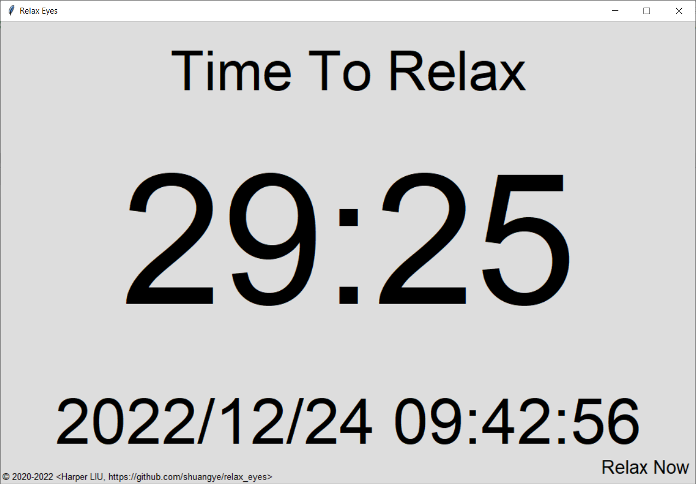
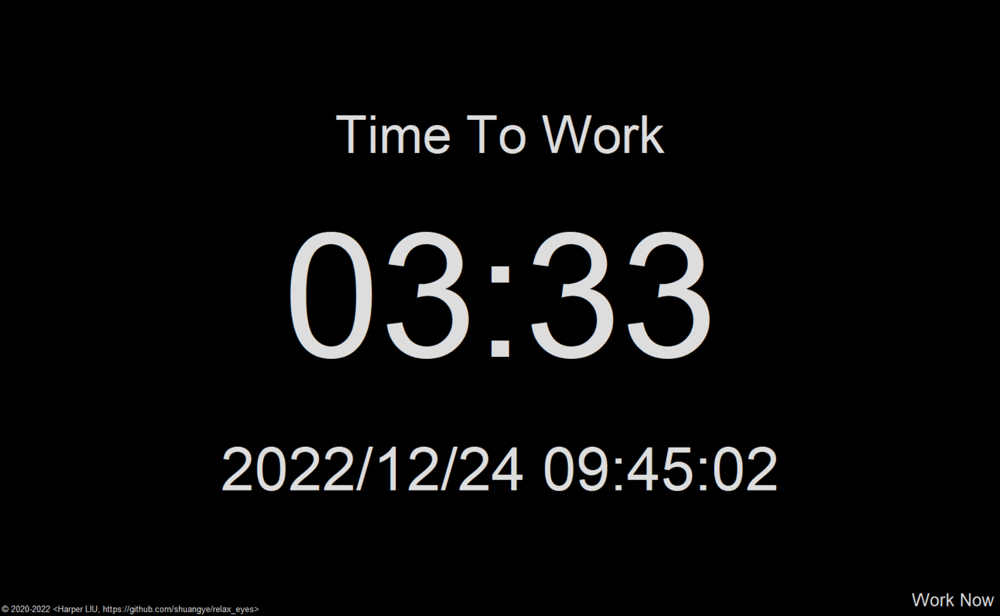

# Relax Your Eyes after A Certain Period 定时放松眼睛

This program reminds you to relax after working for a certain period.

该程序提醒你在工作一段时间后放松眼睛。

# How to Use 如何使用

This is a standard Python3 script. It should run on mainstream platforms like Microsoft Windows, Apple macOS, and Linux distributions.

Change the extension name of relax_eyes.py to ".pyw", and run.

该程序是一个标准的 Python3 脚本，可运行在主流平台上，如微软 Windows、苹果 macOS、以及 Linux 发行版。

把 relax_eyes.py 的后缀名改为 ".pyw"，直接运行即可。

# To Do 待做

- Support multiple screens.
- Allow to force relaxing.
- Remind before x seconds before relaxing.

- 支持多显示器。
- 允许强制休息。
- 开始休息前 x 秒提示。

# Screenshots 运行截屏

Work; shows as a normal window 工作时，以普通窗口形式显示：

Relax; shows in full screen 休息时，全屏显示：

